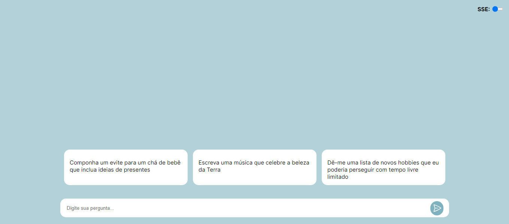

# WebSockets and SSE study

Estudo básico de WebSockets e SSE (Server-Sent Events), eles são usados aqui para reproduzir o efeito dos chatbots de escrever um texto letra por letra. uma pequena interface gráfica esqueleto é usada para interagir com o servidor Websocket ou SSE, usando express

## interface

  
  
## Instalação
```bash
$ npm  install
```

## scripts
```bash
# watch mode
$ npm run dev

# application build
$ npm run build

# production mode
$ npm run start
```
